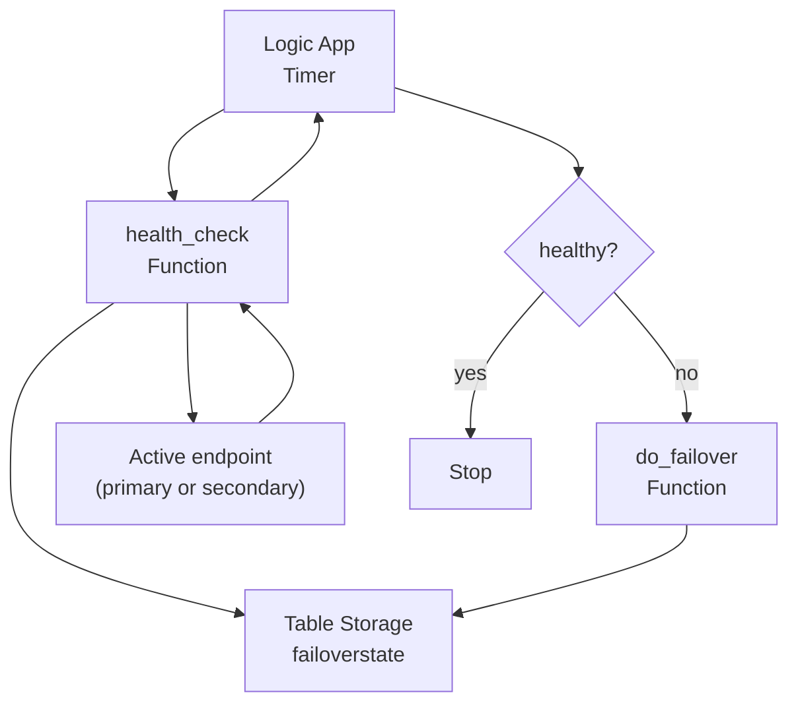

# Microsoft Cloud Devoteam Tribe Demo — Azure Failover Orchestrator
**Knowledge‑sharing demo** for the Microsoft Cloud Devoteam Tribe

This repository demonstrates a **simple, explainable Azure-native failover pattern**, designed for demos and team knowledge sharing.

It mirrors the classic **AWS Step Functions + Lambda + DynamoDB** pattern using Azure services:

- **Azure Logic App (Consumption)** → Orchestration layer  
- **Azure Functions (Python)** → Execution logic  
- **Azure Table Storage** → Centralized state (single source of truth)

---

## What this demo shows

A **deterministic failover loop**:

1. Periodically check the health of the **active endpoint**
2. If the endpoint is unhealthy → **switch traffic target** (primary ↔ secondary)
3. Store all decisions in **one Table Storage entity**
4. Enforce a **cooldown** to avoid infinite failover loops

---

## Architecture (simplified)



---

## Core components

### Logic App
- Runs on a schedule (for example every 1 minute)
- Calls `health_check`
- Decides whether to call `do_failover`

### health_check (Azure Function)
- Reads current state from Table Storage
- Checks the active endpoint health
- Updates status and timestamp
- Returns `healthy = true | false`

### do_failover (Azure Function)
- Enforces cooldown (`lock_until_utc`)
- Toggles `active_target`
- Increments `failover_count`
- Persists the new state

### Table Storage
- **Table:** `failoverstate`
- **One single row only**:
  - PartitionKey = `failover`
  - RowKey = `state`

This table is the **single source of truth**.

---

## End‑to‑end test (step by step)

### 1️⃣ Verify initial state

In **Storage Account → Storage Browser → Tables → failoverstate**, confirm:

- `active_target = primary`
- `failover_count = 0`
- `last_status = OK`

---

### 2️⃣ Test `health_check` manually

```bash
curl "https://<function_app>.azurewebsites.net/api/health_check?code=<HEALTH_KEY>"
```

Expected result:
```json
{
  "healthy": true,
  "active_target": "primary"
}
```

Table updates:
- `last_check_utc` updated
- `last_status = OK`

---

### 3️⃣ Force a failure (safe demo method)

Edit the **Table entity**:
- Set `primary_endpoint` to an invalid URL  
  Example:
  ```
  https://127.0.0.1/health
  ```

Wait for the next Logic App run.

---

### 4️⃣ Observe automatic failover

In **Logic App → Runs history**:
- `health_check` runs
- Condition evaluates to **false**
- `do_failover` is executed

In **Table Storage**, verify:
- `active_target = secondary`
- `failover_count = 1`
- `last_status = FAILOVER_DONE`
- `lock_until_utc` is set

---

### 5️⃣ Validate cooldown protection

Immediately call:
```bash
curl -X POST "https://<function_app>.azurewebsites.net/api/do_failover?code=<FAILOVER_KEY>"
```

Expected result:
```json
{
  "changed": false,
  "reason": "cooldown_active"
}
```

No state change should occur.

---

### 6️⃣ Restore normal state

- Fix `primary_endpoint` back to a valid URL
- Wait for cooldown to expire
- System stabilizes automatically

---

## Deploy everything (Terraform + Functions + Logic App)

This section is written for a **Devoteam Tribe demo**: you can run it end-to-end from a laptop.

### Prerequisites
- Terraform **>= 1.5**
- Azure CLI (`az`)
- A subscription where you can create:
  - Resource Group
  - Storage Account + Table
  - Function App + Service Plan
  - Logic App (Consumption)
- On Linux/macOS: `zip` installed  
  On Windows: PowerShell `Compress-Archive`

### 0) Clone repository
```bash
git clone <your-repo-url>
cd azure-failover-orchestrator
```

### 1) Authenticate to Azure
Interactive (recommended for demo):
```bash
az login
az account set --subscription "<SUBSCRIPTION_ID_OR_NAME>"
az account show -o table
```

Service Principal (CI/non-interactive):
```bash
az login --service-principal -u "<APP_ID>" -p "<CLIENT_SECRET>" --tenant "<TENANT_ID>"
az account set --subscription "<SUBSCRIPTION_ID_OR_NAME>"
```

### 2) Package Functions into a ZIP
Linux/macOS:
```bash
./scripts/package_functions.sh
```

You should now have:
- `functions.zip` at repo root

### 3) Prepare Terraform variables
Copy the example:
```bash
cp infra/terraform.tfvars.example infra/terraform.tfvars
```

Edit `infra/terraform.tfvars`:
- `resource_group_name`
- `location`
- `storage_account_name` (globally unique, lowercase, 3-24 chars)
- `function_app_name`
- `primary_endpoint`
- `secondary_endpoint`
- `functions_zip_path = "../functions.zip"`

For the **first deployment**, set temporary placeholders for keys:
- `health_function_key = "TEMP"`
- `failover_function_key = "TEMP"`

> Why TEMP? Because function keys exist only **after** the Function App is deployed once.

### 4) Deploy infrastructure (first pass)
```bash
cd infra
terraform init
terraform apply
```

This creates:
- Resource Group
- Storage Account + Table `failoverstate`
- Function App + zip deploy
- Logic App workflow (will be updated after we inject real keys)

### 5) Retrieve Function Keys
Go to Azure Portal:
- Function App → Functions → `health_check` → **Function keys**
- Copy `default` key
- Function App → Functions → `do_failover` → **Function keys**
- Copy `default` key

Update `infra/terraform.tfvars`:
```hcl
health_function_key   = "<KEY_HEALTH_CHECK>"
failover_function_key = "<KEY_DO_FAILOVER>"
```

### 6) Apply again (inject keys into Logic App)
```bash
cd infra
terraform apply
```

Now the Logic App calls the Functions securely using function keys.

### 7) Create the initial Table entity (state row)

 - Trigger init lambda from azure console 


### 8) Verify the orchestrator runs
- Logic App → **Runs history**
- You should see runs every interval
- Check the Table entity values update (last_check_utc, last_status)

Then follow the **End-to-end test** section above.

---

## Destroy everything (cleanup)

### Terraform destroy
```bash
cd infra
terraform destroy
```

---

## License

Internal demo for **Devoteam Tribe knowledge sharing**
