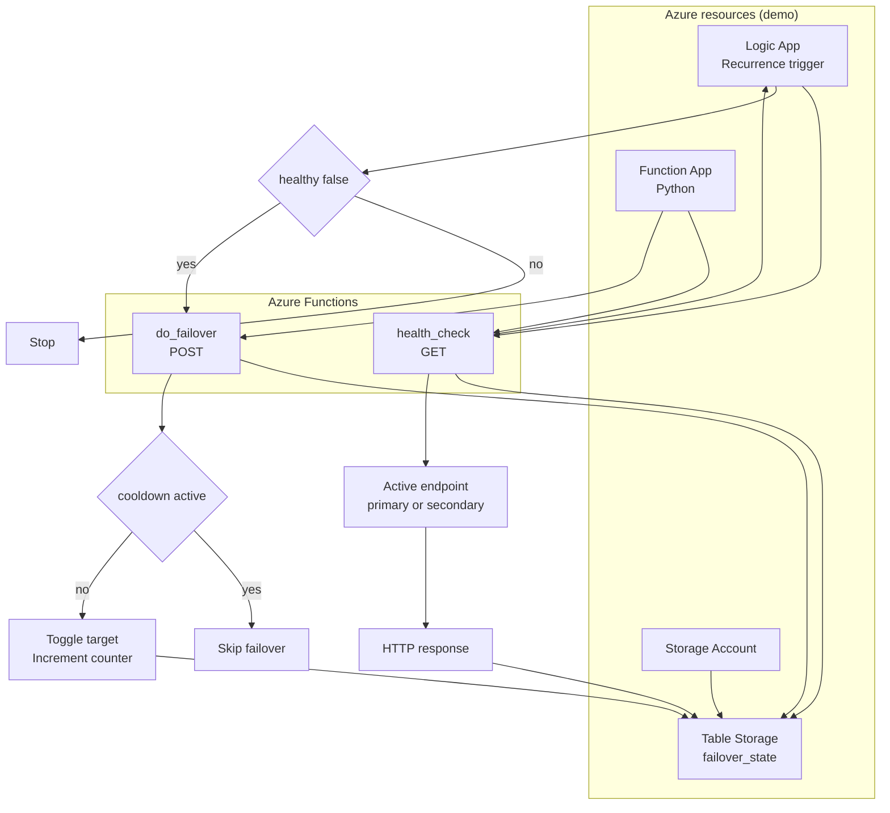

# Microsoft Cloud Devoteam Tribe Demo — Azure Failover Orchestrator
**Knowledge-sharing demo** for the Microsoft Cloud Devoteam Tribe

This repository is a **demo** to share an Azure-native pattern similar to:
**AWS Step Functions + Lambda + DynamoDB**, but implemented with:
- **Azure Logic App (Consumption)** → Orchestrator (Step Functions equivalent)
- **Azure Functions (Python)** → Compute actions (Lambda equivalent)
- **Azure Table Storage** → State store (DynamoDB equivalent)

The demo implements a **deterministic failover loop**:
1) Check active endpoint health  
2) If unhealthy, toggle active target (primary ↔ secondary) with a cooldown lock  
3) Persist state in a single Table Storage entity  

> ⚠️ Demo scope  
> Minimal resources, clear logic, easy to explain.  
> Not intended as-is for regulated production without extra hardening.

---

## Architecture



---

## Repo structure

```
azure-failover-orchestrator/
├── README.md
├── infra/                      # Terraform (Azure resources)
├── functions/                  # Azure Functions (Python)
└── scripts/
```

---

## State model (Table Storage)

**Table:** `failover_state`  
**Single entity only**

| Field | Description |
|---|---|
| active_target | `primary` or `secondary` |
| primary_endpoint | Health URL of primary |
| secondary_endpoint | Health URL of secondary |
| last_status | OK / ERROR / FAILOVER_DONE |
| last_reason | Text reason |
| last_check_utc | ISO timestamp |
| failover_count | Number of failovers |
| lock_until_utc | Cooldown timestamp |

---

## License
Internal demo for Devoteam Tribe knowledge sharing.
